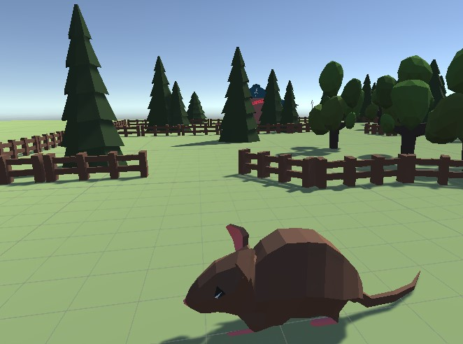

# Unity3Dmice
Software Project University of Oulu. The goal is to create a basic testbed for fast general AI prototyping and testing powered by Unity3D and [Unity Ml-Agents Toolkit](https://github.com/Unity-Technologies/ml-agents).

## Basic info
The provided RollerAgent project is based on [this](https://github.com/Unity-Technologies/ml-agents/blob/master/docs/Learning-Environment-Create-New.md) tutorial. More information is available from [here](https://github.com/Unity-Technologies/ml-agents/blob/master/docs/Training-ML-Agents.md) and [here](https://github.com/Unity-Technologies/ml-agents/blob/master/docs/Learning-Environment-Examples.md).
Some code for the MouseAgent script is derived from [this](http://www.immersivelimit.com/tutorials/machine-learning-pig-agents-unity) tutorial.

## Used 3D models
The project uses some prebuilt Blender 3D models for fast prototyping and at least somewhat pleasent looks:

- [lowpoly mouse](https://www.blendswap.com/blend/16225) by [stepofway](https://www.blendswap.com/profile/336483)

- [Low Poly Barber Shop](https://www.blendswap.com/blend/21439) by [alanporfirio9](https://www.blendswap.com/profile/799258)

- [Wooden Fence - Low Poly Asset](https://www.blendswap.com/blend/13917) by [Kev92](https://www.blendswap.com/profile/15886)

- [Renaissance town houses](https://www.blendswap.com/blend/4616) by [yazjack](https://www.blendswap.com/profile/484)

- [Low poly Cafe](https://www.blendswap.com/blend/10953) by [iamgabo](https://www.blendswap.com/profile/27340)

- [Low poly wolf](https://www.blendswap.com/blend/11562) by [PigArt](https://www.blendswap.com/profile/45794)

- [Low poly forest assets](https://www.blendswap.com/blend/11274) by [PigArt](https://www.blendswap.com/profile/45794)

